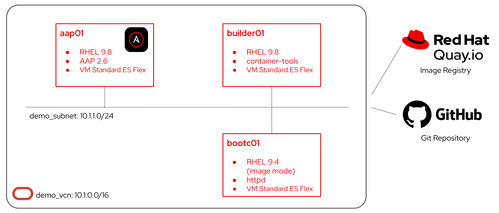

# OCI
This repo includes ansible playbooks and roles for setting up [a demo environment](https://github.com/yukshimizu/bootc-rhel-management-demo) of managing RHEL bootc images with Red Hat Ansible Automation Platform on OCI.

## Environment to be set up

- Single VCN
- Single public subnet
- Single route table
- Single internet gateway
- Single security list (equivalent to security group)
- Single OCI Object Storage bucket (replaces S3)
- Dynamic Group + IAM Policy (replaces vmimport IAM Role/Policy)
- Single Ansible Automation Controller VM
- Single Builder VM

The setup looks like the following:



## Included contents

### Playbooks

|Name     |Role Used|Description|
|:--------|:--------|:----------|
|`create_networks.yml`|N/A|Create VCN, subnet, IGW, route table, security list.|
|`delete_networks.yml`|N/A|Delete all network resources. |
|`create_object_storage.yml`|N/A|Create OCI Object Storage bucket + Dynamic Group + IAM Policy.|
|`delete_object_storage.yml`|N/A|Delete object storage resources.|
|`create_aap_vm.yml`|[roles.aap](../roles/aap/README.md)|Launch OCI instance and configure AAP.|
|`delete_aap_vm.yml`|N/A|Terminate AAP instance.|
|`create_builder_vm.yml`|[roles.builder](../roles/builder/README.md)|Launch OCI instance and configure Builder VM.|
|`delete_builder_vm.yml`|N/A|Terminate Builder instance.|

## Prerequisites

### Basic requirements for Ansible
Any control node:
- ansible core 2.15+

Ansible collections:
- `oracle.oci` (≥ 4.0.0)
- `awx.awx`
- `redhat.rhel_system_roles`

```
$ ansible-galaxy collection install -r requirements.yml
```

In order for functioning Ansible OCI, you need to install Python OCI library.

```
$ pip3 install oci
```

### OCI CLI / SDK configuration
Configure `~/.oci/config` with your tenancy credentials, or use environment variables / instance principal auth. Minimum required fields:

```
[DEFAULT]
user=ocid1.user.oc1..xxxx
fingerprint=xx:xx:xx:...
tenancy=ocid1.tenancy.oc1..xxxx
region=ap-tokyo-1
key_file=~/.oci/oci_api_key.pem
```

### ansible.cfg
Update the private key path:

```
[defaults]
private_key_file = "path to private key file"
```

### Environment variables
Optional if not using ~/.oci/config:
```
$ export OCI_REGION=ap-tokyo-1
$ export OCI_USER_ID=ocid1.user.oc1..xxxx
$ export OCI_FINGERPRINT=xx:xx:xx:...
$ export OCI_TENANCY_ID=ocid1.tenancy.oc1..xxxx
$ export OCI_KEY_FILE=~/.oci/oci_api_key.pem
```

### group_vars/all.yml — required values
Open `group_vars/all.yml` and fill in every field marked `# REQUIRED`:

```
oci_region: "ap-tokyo-1"                            # REQUIRED: adjust with your preferred OCI region
oci_compartment_id: "ocid1.compartment.oc1..xxxx"   # REQUIRED: your compartment OCID
oci_tenancy_id: "ocid1.tenancy.oc1..xxxx"           # REQUIRED: your tenancy OCID (for IAM resources)
oci_availability_domain: "hoge:AP-TOKYO-1-AD-1"     # REQUIRED: e.g. "IyFQ:AP-TOKYO-1-AD-1"
oci_object_storage_namespace: "mytenancynamespace"  # REQUIRED: your tenancy's namespace (oci os ns get)
oci_aap_instance_image_id: "ocid1.image.oc1.ap-tokyo-1.xxxx"  # REQUIRED: RHEL image OCID in your region/compartment
oci_builder_instance_image_id: "ocid1.image.oc1.ap-tokyo-1.xxxx"   # REQUIRED: RHEL image OCID (can be same as AAP)
```

### inventory/oci_inventory.oci.yml - required values
Open `inventory/oci_inventory.oci.yml` and fill in every field marked `# REQUIRED`:
```
# Authentication (uses ~/.oci/config by default)
config_file: ~/.oci/config      # REQUIRED

compartments:
  - compartment_ocid: "ocid1.tenancy.oc1..xxxx"    # REQUIRED
```

### RHEL image
Before setting up the environment, you need to import the RHEL image as a custom image on OCI. Please follow the instruction described in [RHEL runs on OCI supported by Oracle and Red Hat](https://blogs.oracle.com/cloud-infrastructure/red-hat-enterprise-linux-supported-oci).

Once imported the image, you can find the image id in your region:
```
$ oci compute image list \
  --compartment-id "ocid1.tenancy.oc1..xxxx" \
  --region ap-tokyo-1 \
  --all \
  --query "data[*].{name:\"display-name\", id:id}" \
  --output table
```

## Usage

### 1. Create required network resources
This playbook need to be run at the beginning.
```
$ ansible-playbook create_networks.yml
```

### 2. Create object storage resources
This playbook should be run before performing a demo.
```
$ ansible-playbook create_object_storage.yml
```

### 3. Create Ansible Automation Platform
This playbook can run after running `create_networks` playbook.
```
$ ansible-playbook create_aap_vm.yml
```
And, the following variables are prompted at run-time. Also refer to [roles.aap](../roles/aap/README.md) for the role details.
```
oci_ssh_public_key # Path to your ssh public key file
rhsm_username # Your Red Hat login name
rhsm_passwd # Password for your Red Hat login
aap_admin_passwd # Password for your AAP admin user
aap_pg_passwd # PostgreSQL password for your AAP deployment
```

### 4. Create Builder VM
This playbook can run after running `create_networks` playbook.
```
$ ansible-playbook create_builder_vm.yml
```

And, the following variables are prompted at run-time. Also refer to [roles.builder](../roles/builder/README.md) for the role details.
```
oci_ssh_public_key # Path to your ssh public key file
rhsm_username # Your Red Hat login name
rhsm_passwd # Password for your Red Hat login
```

### 5. Clean up the environment
All the delete resource playbooks corresponding to each create resource playbook are avaialble. Those playbooks can run assuming related variables have already set previously.
```
$ ansible-playbook delete_builder_vm.yml
$ ansible-playbook delete_aap_vm.yml
$ ansible-playbook delete_object_storage.yml
$ ansible-playbook delete_networks.yml
```
